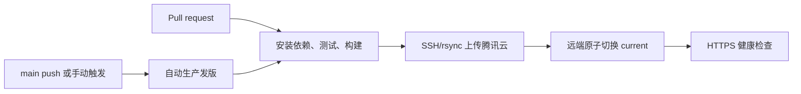

# GitHub Actions 发版改造实现计划

## 需求理解

- **目标**：代码合入 `main` 后无需人工审批，由 GitHub Actions 自动完成测试、构建和生产发布，同时允许在 Actions 页面手动重跑发版；PR 只执行质量检查，不接触生产凭据。
- **现状**：项目是 Vue 3 + Vite 静态站点，使用 pnpm lockfile；`pnpm run deploy` 在本机执行 Vitest 和 Vite 构建，再通过 SSH/rsync 上传腾讯云，远端脚本将新目录原子切换为 `current`，保留最近 5 个版本并重载 Nginx，最后以 `https://kana.kevinlau.cn/` 做健康检查。仓库目前没有 `.github/` 工作流，也没有显式固定 Node/pnpm 版本。
- **参考实现**：`../next-blog/.github/workflows/admin-deploy.yml` 已使用 `main` push 自动触发，并通过仓库 Secrets `SERVER_HOST`、`SERVER_USERNAME`、`SERVER_SSH_KEY` 将静态资源 SSH 部署到服务器；`../next-blog/docs/deployment.md` 也明确记录了这组仓库 Secrets。当前项目沿用其触发方式和变量命名，但不照搬旧版 action、`latest` 工具链和直接覆盖目录方式。
- **约束**：已确认 GitHub-hosted runner 可以访问服务器 SSH，且服务器侧允许配置本项目所需部署权限。生产机仍需具备 `bash`、`rsync`、`nginx`；部署账号需能写入 `/www/wwwroot/kana.kevinlau.cn`、校验/重载 Nginx，并按当前脚本设置 `www:www` 所有权。SSH 私钥和主机指纹只能配置在当前仓库 `Settings → Secrets and variables → Actions` 中，不使用个人账号、Organization Secrets、仓库文件或 Actions 日志保存凭据。
- **方案**：保留 `scripts/deploy-remote.sh` 的版本目录和原子切换逻辑，将本地部署脚本拆成可在 CI 复用、可明确传入连接信息的发布入口；新增独立 CI 与生产部署工作流。为本仓库单独生成一对部署 SSH key，私钥仅存当前仓库的 Repository Secret，公钥仅授权到服务器部署用户。生产 job 在 `main` push 后自动运行，不配置 Environment reviewer；使用最小权限和 concurrency 串行化，先以 `pnpm install --frozen-lockfile`、测试、构建形成发布产物，再配置 SSH 并部署、健康检查。失败时不覆盖当前线上版本；发布成功后保留 Actions 运行记录及提交 SHA，以便追溯。

## 一、固定构建工具链并拆分发布职责

涉及文件：[`package.json`](../../package.json)、[`scripts/deploy.sh`](../../scripts/deploy.sh)、[`scripts/deploy-remote.sh`](../../scripts/deploy-remote.sh)

1. 在 `package.json` 声明与当前依赖兼容的 Node 版本（当前 lockfile 中依赖要求 Node `^22.13.0 || >=24.0.0`，工作流固定使用 Node 22 的满足版本）和 `packageManager`，确保本机与 Actions 使用一致的 pnpm 主版本；保留 `test`、`build` 命令作为 CI 的唯一质量门禁。
2. 调整 `scripts/deploy.sh`，让构建/验证与上传职责可分开调用：CI 已完成测试构建时只发布既有 `dist/`，本机 `pnpm run deploy` 仍可维持原有一键测试、构建、发布体验。所有连接参数显式来自环境变量，避免依赖 GitHub runner 中不存在的本机 SSH Host alias。
3. 为 SSH host、user、port、远端根目录和站点域名设置清晰的必填/默认规则；部署前校验 `dist/index.html`、目标域名和远端路径，防止空变量或错误目标导致上传到非预期目录。
4. 将发布标识扩展为“UTC 时间 + 短 commit SHA（CI 中）”或另存提交元数据，使线上目录能追溯到 Git 提交；同步收紧远端参数校验。保留 `incoming -> releases -> current` 原子切换及最近 5 版清理行为。

## 二、新增 PR/分支质量检查工作流

涉及文件：拟新增 [`.github/workflows/ci.yml`](../../.github/workflows/ci.yml)

1. 在 `pull_request` 和对 `main` 的 push 上触发；配置只读 `contents: read` 权限、超时和按分支取消旧运行的 concurrency，避免重复消耗 runner。
2. 使用固定 major/version 的官方 `actions/checkout`、`pnpm/action-setup`、`actions/setup-node`，启用 pnpm 缓存并执行 `pnpm install --frozen-lockfile`。
3. 顺序执行 `pnpm test` 和 `pnpm build`；任何一步失败即阻止 CI 通过。无需上传长期 artifact，因为生产工作流会针对待发布提交重新构建，避免把未经当前运行验证的产物部署到生产。

## 三、新增生产发版工作流

涉及文件：拟新增 [`.github/workflows/deploy.yml`](../../.github/workflows/deploy.yml)

1. 参考 `../next-blog`，支持 `push` 到 `main` 后无需审批自动触发，并补充 `workflow_dispatch` 手动重跑入口；设置固定 production concurrency 且不取消正在执行的部署，杜绝两个发布同时操作 `current`。
2. 重复执行锁文件安装、Vitest 和 Vite build，确保部署的正是当前提交且质量门禁在同一运行内通过；使用最小 `contents: read` 权限，不授予无关的 token 写权限。
3. 沿用 `../next-blog` 的命名，从当前仓库 Repository Secrets 注入 `SERVER_SSH_KEY`、`SERVER_HOST`、`SERVER_USERNAME`，并新增 `SERVER_KNOWN_HOSTS`；从 Repository Variables 注入非敏感的 `SERVER_PORT`，站点域名与固定远端根目录保留在受版本控制的部署脚本中。临时写入权限为 `0600` 的 SSH key/known_hosts，强制 `StrictHostKeyChecking=yes`，不得用运行时 `ssh-keyscan` 的未核验结果替代预先确认的主机指纹。
4. 调用仓库发布脚本上传 `dist/` 并执行远端原子切换；部署后对 HTTPS 首页执行带超时和有限重试的健康检查，在 Actions summary 中记录站点 URL、commit SHA、run URL 和结果。
5. 无论成功失败都清理 runner 上的临时私钥。健康检查失败时 job 失败并保留此前线上版本目录；自动回滚不纳入首期，避免一次瞬时外网探测失败触发错误回滚，运维人员可将 `current` 指向上一版本后重载 Nginx。

## 四、配置 GitHub 与服务器侧发布权限

涉及位置：GitHub 仓库 Settings（外部配置）、腾讯云服务器 SSH/Nginx 权限（外部配置）

1. 在当前仓库进入 `Settings → Secrets and variables → Actions`，创建 Repository Secrets：`SERVER_HOST`、`SERVER_USERNAME`、`SERVER_SSH_KEY`、`SERVER_KNOWN_HOSTS`；创建 Repository Variable：`SERVER_PORT`（默认 `22`）。不创建 Organization Secret，也不使用 Environment reviewer，以满足 `main` 合入后完全自动发布。
2. 为当前仓库单独创建一对 ed25519 部署 SSH key，不复用个人私钥或其他仓库的部署密钥。私钥完整内容放入 `SERVER_SSH_KEY`；公钥追加到服务器部署用户的 `~/.ssh/authorized_keys`。如果将来停用此仓库，只需从服务器移除这一条公钥，不影响其他仓库。
3. 为部署公钥设置可辨识注释，并尽可能在 `authorized_keys` 中增加来源、可执行命令或能力限制；部署用户仅获得当前站点所需的目录写入、`chown`、`nginx -t` 和 reload 权限。若不能以非 root 用户直接执行这些命令，应将固定命令封装为 root-owned 脚本并只授权对应 sudo 命令，不开放通配 sudo。
4. 从可信渠道获取服务器 SSH host key，保存为当前仓库的 `SERVER_KNOWN_HOSTS`。服务器连通性已有 `../next-blog` 的同类自动部署作为依据，实施时仍需用新密钥验证 SSH 与 rsync，避免误判账号或目录权限。
5. 在仓库 branch protection/ruleset 中将 CI job 设为 `main` 合并前必需检查；限制可直接 push 到 `main` 的主体。由于生产发布完全自动，合并权限与必需检查就是生产发布的审批边界。

## 五、补齐发布、回滚与故障排查文档

涉及文件：[`README.md`](../../README.md)

1. 将部署说明更新为 GitHub Actions 的自动/手动触发方式、`main` 合入即自动生产发布的行为、所需 Repository Secrets/Variables 名称和首次配置清单；保留本机部署入口作为应急方式，并标明它需要同等权限。
2. 记录发布失败的排查顺序：CI 测试/构建、SSH 握手、rsync 权限、远端 `nginx -t`、线上 HTTPS 健康检查。
3. 给出可审计的手动回滚流程：在服务器列出 `releases/`，确认目标版本存在且包含 `index.html`，原子更新 `current`，执行 `nginx -t` 后 reload，再检查首页。不要在文档中包含真实私钥、服务器密码或 Secrets 值。

## 完整需求专项检查

- **接口 Mock**：不适用。本次仅调整静态站点的构建与部署链路，不新增业务接口；现有部署后的 HTTPS 首页检查足以覆盖发布连通性。
- **单元测试**：项目已有 Vitest、`pnpm test` 和 `src/App.test.js`。Actions 必须运行全部现有测试，并以测试通过作为构建与发布前置条件；本次 shell/workflow 改造没有现成 shell 测试框架，采用 `bash -n`、Actions 语法检查和受控手动发布演练作为补充验证，不为此额外引入整套测试框架。

## 验证顺序

1. 本地执行 `pnpm install --frozen-lockfile`、`pnpm test`、`pnpm build`，确认固定工具链可复现且生成 `dist/index.html`。
2. 执行 `bash -n scripts/deploy.sh scripts/deploy-remote.sh`，并用 Actions/linter 校验 `.github/workflows/*.yml` 语法和 action 参数。
3. 创建测试 PR，确认 CI 自动运行、不会读取 production Secrets，且测试或构建失败会阻止合并。
4. 首次通过 `workflow_dispatch` 手动发布，确认无需 Environment 审批，且 SSH host key 校验、上传、远端 `nginx -t`、原子切换和 HTTPS 健康检查全部成功；核对线上版本目录可映射到 commit SHA。
5. 快速连续触发两次手动发布，确认 production concurrency 串行执行且不会相互删除/覆盖上传目录。
6. 用无权限 key 或错误 host key 做一次受控失败验证，确认工作流在切换 `current` 前停止，Secrets 不出现在日志中，线上站点不受影响。
7. 选择上一发布版本演练手动回滚并再次访问 `https://kana.kevinlau.cn/`；随后恢复最新版本。

## 明确不做

- 不迁移到 GitHub Pages、Vercel、Cloudflare 或其他托管平台，继续使用现有腾讯云与 Nginx。
- 不在首期自动创建 Git tag、GitHub Release 或生成 changelog；这里的“发版”定义为将 `main` 的指定提交部署到生产站点。
- 不将 Nginx 证书私钥、服务器登录凭据或其他生产 Secrets 提交进仓库。
- 不在首期实现健康检查失败后的自动回滚；先提供明确的人工回滚与可追溯版本。
- 不使用个人账号级、Organization 级或跨仓库共享的 SSH 私钥；每个仓库使用独立密钥并独立吊销。

## 实施跟踪规则

- 实施过程中以本文末尾 TODO 为进度依据。
- 开始任务前先读取 TODO；每完成一个可独立验收的交付项并通过相关验证后，立即将对应的 `- [ ]` 更新为 `- [x]`。
- 不要等全部开发结束后一次性勾选，不得在缺少验证结果时提前勾选。
- 遇到阻塞时保持未勾选，并在该项后补充阻塞原因。
- 新发现的必要工作应补充为新的 checkbox，不得删除未完成事项。

## TODO

- [x] 固定 Node/pnpm 工具链，并使发布脚本同时适配本机和无 SSH alias 的 GitHub runner。
- [x] 完善远端发布标识、参数校验和提交追溯信息，保持原子切换与最近 5 版清理。
- [x] 新增 PR/main 的 CI 工作流，并验证 frozen install、Vitest 和 Vite build。
- [x] 新增 `main` 合入后完全自动执行的 production 部署工作流，并完成并发锁、严格 SSH 校验、部署、健康检查及密钥清理。
- [ ] 为当前仓库生成独立 SSH key，并按 `../next-blog` 命名配置 Repository Secrets/Variables、分支保护及服务器最小权限部署账号。已完成专用密钥、服务器授权、4 个 Repository Secrets、`SERVER_PORT` Variable 和真实部署验证；GitHub 在保存 `main` 分支保护规则时要求账号二次验证，待用户完成验证码后保存。
- [x] 更新 README 中的发版、Secrets、排错和人工回滚说明。
- [ ] 完成 PR 检查、首次手动发布、并发、受控失败和人工回滚验收。
